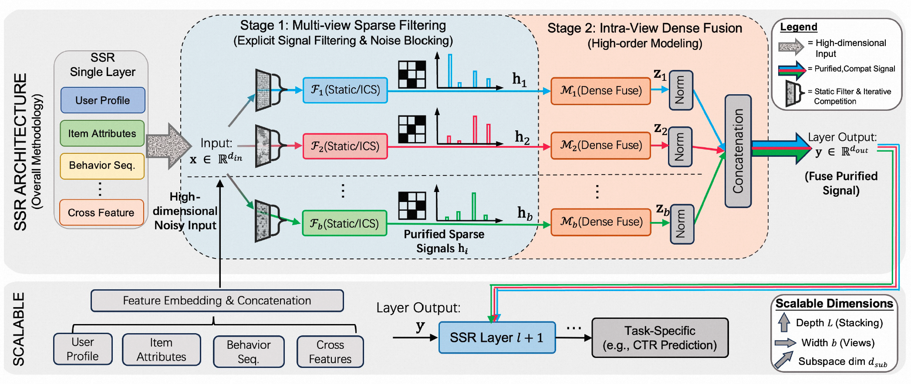

<div align="center">
<h2 align="center">
  <b>
    <span>━━━━━━━━━━━━━━━━━━━━━━━━━━━</span>
    <br/>
    SSR: Explicit Sparsity for Scalable Recommendation
    <br/>
    <span>━━━━━━━━━━━━━━━━━━━━━━━━━━━</span>
    <br/>
  </b>
</h2>
</div>

<p align="center">
  <a href="../ssr_final.pdf">Paper</a> &nbsp;|&nbsp;
  <a href="#overview">Overview</a> &nbsp;|&nbsp;
  <a href="#results">Results</a> &nbsp;|&nbsp;
  <a href="#online-ab-testing">Online A/B</a> &nbsp;|&nbsp;
  <a href="#citation">Citation</a>
</p>

<p align="center">
  
</p>
<p align="center"><em>
  The SSR Framework: (1) Multi-view Sparse Filtering decomposes input into parallel views for dimension-level signal filtering, (2) Intra-view Dense Fusion applies nonlinear transformation within refined subspaces. Two filtering strategies are provided: Static Random Filter (SSR-S) and Iterative Competitive Sparse (SSR-D).
</em></p>

---

This is the official repository for **SSR (Explicit Sparsity for Scalable Recommendation)**, a backbone framework that shifts from implicit weight suppression to explicit signal filtering for scaling recommendation models on sparse data. SSR introduces a "filter-then-fuse" paradigm: decomposing inputs into parallel views for dimension-level sparse filtering, followed by dense fusion — ensuring expanded capacity is dedicated to valid signals rather than noise.

## Overview

Standard dense backbones (e.g., deep MLPs) suffer from a structural mismatch with sparse recommendation data: over 92% of learned connection weights are suppressed to near-zero, while 80% of weight power concentrates in just the top 4% of dimensions. Simply scaling dense architectures yields diminishing returns or performance degradation.

**SSR** replaces indiscriminate dense connectivity with explicit sparsity through a two-stage process per view:

$$\mathbf{h}_i = \mathcal{F}_i(\mathbf{x}), \quad \mathbf{z}_i = \sigma(\mathbf{h}_i \mathbf{V}_i + \text{bias}_i)$$

$$\mathbf{y} = \text{Concat}(\text{LayerNorm}(\mathbf{z}_1), \ldots, \text{LayerNorm}(\mathbf{z}_b))$$

where $\mathcal{F}_i$ is a sparse filter operator (static or dynamic) and $\mathbf{V}_i$ is a view-specific dense projection. This reduces parameter complexity from $O((b \cdot d_v)^2)$ to $O(b \cdot d_v^2)$ — a factor of $1/b$ reduction.

### SSR-S: Static Random Filter

Each view selects a fixed random subset of input dimensions via a binary selection matrix (zero-FLOP parallel gather). This enforces hard structural sparsity with a "Feature Bagging" effect across views.

### SSR-D: Iterative Competitive Sparse (ICS)

A differentiable, bio-inspired dynamic mechanism where features compete for survival through iterative mean-field global inhibition:

$$\mathbf{x}^{(t+1)} = \text{ReLU}\left(\mathbf{x}^{(t)} - \alpha_t \cdot \mu^{(t)}\right)$$

Over $T$ iterations, noise dimensions are progressively driven to true zero while high-response signals are retained — achieving $O(T \cdot N)$ linear complexity without sorting.

<details>
<summary><b>PyTorch-style pseudocode (ICS)</b></summary>

```python
def ics_forward(z: Tensor, alpha: list[float], gamma: Tensor, T: int) -> Tensor:
    """
    Iterative Competitive Sparse (ICS) Forward Pass.
    z:     [B, d_v]  projected feature vector
    alpha: T learnable extinction rates
    gamma: [d_v]     learnable signal recovery scale
    T:     number of competition iterations
    """
    x = F.relu(z)                          # Initialize: non-negative rectification
    for t in range(T):
        mu = x.mean(dim=-1, keepdim=True)  # Global inhibition field
        x = F.relu(x - alpha[t] * mu)      # Survival of the fittest
    y = gamma * x                          # Signal recovery
    return y
```

</details>

<details>
<summary><b>PyTorch-style pseudocode (SSR Layer)</b></summary>

```python
def ssr_layer_forward(x: Tensor, views: int, filters: list, projections: list) -> Tensor:
    """
    Single SSR Layer: Multi-view Sparse Filtering + Intra-view Dense Fusion.
    x:           [B, d_in]  concatenated input embeddings
    views:       number of parallel views (b)
    filters:     list of b sparse filter operators (SSR-S or SSR-D)
    projections: list of b dense projection layers (V_i)
    """
    outputs = []
    for i in range(views):
        h_i = filters[i](x)                          # Sparse filtering
        z_i = F.gelu(projections[i](h_i))             # Dense fusion
        outputs.append(F.layer_norm(z_i, z_i.shape))   # Normalize
    y = torch.cat(outputs, dim=-1)                     # Concatenate views
    return y
```

</details>

## Results

### Industrial Dataset (Billion-scale, 300+ feature fields)

| Category | Model | #Params | FLOPs | Click AUC | Click GAUC | Pay AUC | Pay GAUC |
|:---|:---|:---:|:---:|:---:|:---:|:---:|:---:|
| Classic | DeepFM | 13M | 0.6G | 0.6563 | 0.6251 | 0.8053 | 0.6730 |
| | DCNv2 | 15M | 0.9G | 0.6571 | 0.6262 | 0.8065 | 0.6742 |
| Attention | AutoInt | 26.2M | 1.7G | 0.6594 | 0.6279 | 0.8078 | 0.6769 |
| SOTA | Wukong | 93M | 2.9G | 0.6615 | 0.6298 | 0.8115 | 0.6805 |
| | RankMixer | 101M | 3.2G | 0.6621 | 0.6305 | 0.8122 | 0.6815 |
| **Ours** | **SSR-S** | **57M** | **1.4G** | **0.6644** | **0.6326** | **0.8162** | **0.6841** |
| | **SSR-D** | **100M** | **3.3G** | **0.6667** | **0.6351** | **0.8194** | **0.6862** |

SSR-S outperforms RankMixer using only **56% of parameters** and **44% of FLOPs**. SSR-D achieves the best results across all metrics with comparable compute budget.

### Public Benchmarks (Avazu / Alibaba / Criteo)

| Model | Avazu AUC | Alibaba AUC | Criteo AUC |
|:---|:---:|:---:|:---:|
| DeepFM | 0.7752 | 0.6594 | 0.7986 |
| DCNv2 | 0.7729 | 0.6526 | 0.8064 |
| AutoInt | 0.7722 | 0.6784 | 0.8053 |
| RankMixer | 0.7772 | 0.6801 | 0.8092 |
| **SSR-S** | **0.7827** | **0.6827** | **0.8098** |
| **SSR-D** | **0.7835** | **0.6844** | **0.8096** |

SSR achieves consistent improvements across all benchmarks. On Avazu, SSR-S cuts parameters and FLOPs by roughly half relative to RankMixer while improving AUC.

### Scalability

SSR exhibits superior scaling properties compared to dense baselines. While Dense MLP saturates early and RankMixer shows flattening growth, SSR maintains a steep upward trajectory from 5M to 900M parameters — the performance gap widens as models scale up.


## Online A/B Testing

Deployed against the production RankMixer baseline over a two-week period:

| Model | Latency | CTR Lift | Orders Lift | GMV Lift |
|:---|:---:|:---:|:---:|:---:|
| **SSR-D** | 26ms (+1ms) | **+2.1%** | **+3.2%** | **+3.5%** |

SSR-D delivers significant business metric improvements with negligible latency overhead (+1ms).

## Citation

If you found our work useful, please cite

```bib
@inproceedings{2026ssrnet,
  title         = {Beyond Dense Connectivity: Explicit Sparsity for Scalable Recommendation},
  author        = {Yantao Yu, Sen Qiao, etc},
  booktitle     = {SIGIR},
  year          = {2026},
  archiveprefix = {arXiv},
  eprint        = {2604.08011}
}
```
